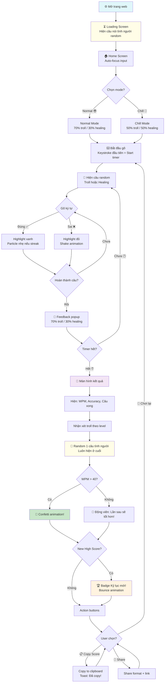
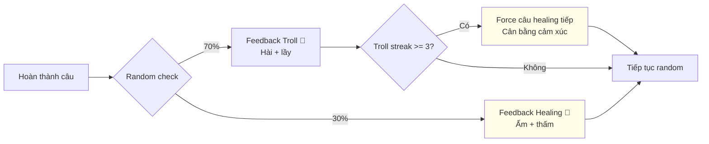
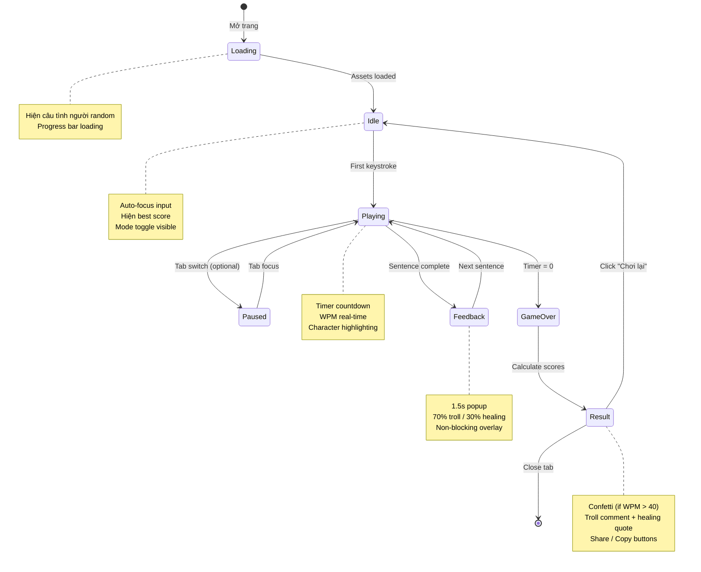

# 📝 TYPING TROLL — GÕ NHANH XẢ STRESS & NGẪM ĐỜI

## Business Requirements Document (BRD) v1.0

> *"Gõ cho sướng tay, cười cho sảng khoái, rồi bất ngờ... thấm!"*

**Ngày tạo:** 10/03/2026
**Phiên bản:** 1.0
**Tác giả:** BA / UX Design / Content Curator Team
**Trạng thái:** Draft → Review

---

## 📑 Mục lục

1. [Tổng quan & Mục tiêu sản phẩm](#1-tổng-quan--mục-tiêu-sản-phẩm)
2. [Yêu cầu chức năng (User Stories)](#2-yêu-cầu-chức-năng-user-stories)
3. [Yêu cầu giao diện & UX](#3-yêu-cầu-giao-diện--ux)
4. [Yêu cầu phi chức năng](#4-yêu-cầu-phi-chức-năng)
5. [Nội dung & Data Model](#5-nội-dung--data-model)
6. [User Flow & Edge Cases](#6-user-flow--edge-cases)
7. [Tech Stack & Architecture](#7-tech-stack--architecture)
8. [Testing & Deployment](#8-testing--deployment)
9. [Phân tích bổ sung (SWOT & Mở rộng)](#9-phân-tích-bổ-sung)

---

## 1. Tổng quan & Mục tiêu sản phẩm

### 1.1. Mô tả trò chơi

**Typing Troll** là một mini-game web typing test "made in Vietnam", nơi người chơi gõ lại những câu troll lầy lội, meme relatable (crush bơ, nghèo mà sang, cày cuốc deadline, mẹ mắng...) trong vòng **60 giây**. Điểm đặc biệt: **thỉnh thoảng, giữa cơn cười lăn lộn, game sẽ "lén" chèn một câu nói nhân văn, tình người — khiến người chơi từ cười haha bỗng "ơ... hay thật"** rồi lại cười tiếp.

**Công thức vàng:**
```
70% Troll lầy cười xỉu 🤡 + 30% Câu nói tình người thấm thía 💛 = Xả stress HOÀN HẢO
```

**Gameplay core:**
- Màn hình hiện câu random (troll hoặc chữa lành) → Người chơi gõ lại chính xác
- Timer đếm ngược 60 giây
- WPM (Words Per Minute) tính real-time
- Feedback sau mỗi câu: troll hài hước hoặc câu nói tình người bất ngờ
- Kết thúc: Bảng điểm + nhận xét troll/chữa lành + nút share

### 1.2. Mục tiêu chính

| # | Mục tiêu | Mô tả chi tiết | Đo lường |
|---|----------|----------------|----------|
| 1 | **Xả stress tối đa** | Người chơi cười đau bụng với câu troll lầy, quên hết muộn phiền | Feedback "cười" > 80% |
| 2 | **Chữa lành nhẹ nhàng** | Câu nói tình người xuất hiện bất ngờ → người chơi "ồ, hay thật" → cảm giác ấm áp | Feedback "thấm" > 60% |
| 3 | **Cân bằng vui + sâu** | Không troll quá đà gây buồn, không sâu sắc quá mất vibe vui → hoàn hảo | Tỷ lệ 70/30 troll/chữa lành |
| 4 | **Gây nghiện lành mạnh** | Phá kỷ lục WPM, unlock câu mới, "hôm nay câu nào hay nhỉ?" | Replay rate > 3 lần/session |

### 1.3. Mục tiêu phụ

- **Viral potential**: Share score kèm câu nói hay lên social → "Ê gõ đi, vừa cười vừa ngộ lắm!"
- **Thói quen tích cực**: Mỗi ngày gõ 1 round = 1 phút xả stress + nhận 1 "liều thuốc tinh thần"
- **Cộng đồng**: Tạo trend "câu nào thấm nhất" trên social media
- **Accessibility**: Ai cũng chơi được, không cần đăng ký, không cần tải app

### 1.4. KPIs (Key Performance Indicators)

| KPI | Target | Cách đo |
|-----|--------|---------|
| Thời gian chơi trung bình / session | > 3 phút (≥ 3 rounds) | Analytics event |
| Tỷ lệ chơi lại (replay rate) | > 65% | localStorage tracking |
| Tỷ lệ share score | > 15% | Click event on share button |
| Feedback "vừa cười vừa thấm" | > 70% | Optional emoji reaction |
| Bounce rate (rời sau <10s) | < 20% | Tính bằng timer + interaction |
| High score attempts | > 2 lần / user | localStorage |

### 1.5. Đối tượng mục tiêu (Target Audience)

**Primary:** Giới trẻ Việt Nam 18-30 tuổi
- Sinh viên stress deadline, thi cử
- Dân văn phòng cày cuốc 9-to-5 muốn "nghỉ ngơi 1 phút"
- Fan meme, thích content lầy lội nhưng cũng cần "chút ấm áp"

**Secondary:**
- Người dùng internet Việt thích typing test (fan MonkeyType bản Việt)
- Content creator tìm game để làm video reaction
- Ai đó đang buồn, cần "liều thuốc tinh thần" nhẹ nhàng

**Persona mẫu:**
> **Minh, 24 tuổi, developer junior**
> Cày code 10 tiếng/ngày, stress with bugs. Mở Typing Troll lúc nghỉ trưa, gõ câu "Deadline là dead nhưng line thì còn dài lắm" → cười phọt. Rồi bất ngờ gõ câu "Đừng so sánh hành trình của mình với ai, mỗi người một tốc độ" → "Ừ ha, mình đang cố gắng mà". Đóng tab, cảm thấy nhẹ hơn 10%.

### 1.6. Phạm vi dự án (Scope)

**Trong phạm vi (In Scope):**
- Gameplay typing test 60 giây
- 100+ câu troll + 50+ câu chữa lành
- Feedback system (troll + tình người)
- High score lưu local
- Chill Mode (nhiều câu chữa lành hơn)
- Share score + câu nói hay
- Responsive mobile-first
- Dark mode
- Hiệu ứng (confetti, particle, shake)

**Ngoài phạm vi (Out of Scope):**
- Backend / database server
- Đăng ký / đăng nhập
- Multiplayer
- Leaderboard online
- Monetization / ads

### 1.7. Rủi ro & Giải pháp

| Rủi ro | Mức độ | Giải pháp |
|--------|--------|-----------|
| Troll quá đà → user buồn | Medium | Cân bằng 70/30, câu chữa lành xuất hiện đúng lúc (sau chuỗi troll) |
| Câu chữa lành làm mất vibe vui | Medium | Đặt ở vị trí bất ngờ, wrap trong context hài hước |
| Nội dung nhàm sau nhiều lần chơi | High | 150+ câu, shuffle tốt, update content định kỳ |
| Gõ tiếng Việt có dấu khó | Medium | Câu dùng Telex/VNI phổ thông, option không dấu |
| Mobile keyboard che content | High | Layout responsive, input sticky bottom, câu ở trên |

---

## 2. Yêu cầu chức năng (User Stories)

### 2.1. Epic: Gameplay Core

#### US-001: Bắt đầu game nhanh
```
As a stressed user,
I want to start typing immediately when I open the page,
So that I can release stress RIGHT NOW without waiting.

Acceptance Criteria:
- Page load < 1.5s
- Input auto-focus on load
- First keystroke starts timer
- No signup/login required
- Loading screen shows câu nói random (troll hoặc chữa lành)
```

#### US-002: Gõ câu troll lầy lội
```
As a player who loves memes,
I want to type hilarious Vietnamese troll sentences,
So that I laugh while typing and forget my stress.

Acceptance Criteria:
- 100+ câu troll unique, relatable cho gen Z Việt
- Câu hiển thị to, rõ, giữa màn hình
- Ký tự đúng highlight xanh, sai highlight đỏ + rung nhẹ
- Hoàn thành câu → feedback troll hài hước
- Câu mới random ngay, không trùng trong cùng session
```

#### US-003: Nhận câu nói tình người bất ngờ
```
As a player,
I want to occasionally (20-30%) receive a deep, wholesome quote
instead of a troll sentence,
So that I get a gentle "aha moment" amidst the laughter.

Acceptance Criteria:
- 50+ câu nói tình người, dạy bảo nhẹ nhàng
- Xuất hiện random 20-30% (hoặc theo chế độ Chill)
- Hiện câu với style khác biệt (font nhẹ hơn, icon 💛)
- Feedback sau câu tình người: ấm áp, không troll
- Pop-up nhẹ với animation fade-in khi xuất hiện
```

#### US-004: Timer & WPM real-time
```
As a competitive player,
I want to see timer countdown and WPM in real-time,
So that I can push myself to type faster.

Acceptance Criteria:
- Timer 60s đếm ngược, hiển thị góc trên
- WPM cập nhật mỗi giây
- Accuracy % hiển thị
- Timer đổi màu khi < 10s (warning đỏ nhẹ)
- Kết thúc khi timer = 0
```

#### US-005: Feedback sau mỗi câu
```
As a player who just completed a sentence,
I want funny/wholesome feedback,
So that I feel entertained and motivated to continue.

Acceptance Criteria:
- 70% chance: Feedback troll hài (ví dụ: "Gõ nhanh vl! Crush chắc rep không kịp 😏")
- 30% chance: Feedback chữa lành (ví dụ: "Giỏi lắm! Nhớ nhé: mỗi ngày là một cơ hội mới 💛")
- Feedback hiện 1.5s rồi fade out
- Animation nhẹ (bounce in)
- Không block gameplay (hiện overlay nhẹ)
```

### 2.2. Epic: Kết quả & Chia sẻ

#### US-006: Màn hình kết quả
```
As a player who finished a round,
I want to see my detailed results with troll/wholesome commentary,
So that I feel accomplished and entertained.

Acceptance Criteria:
- Hiện: WPM, Accuracy %, số câu hoàn thành, số lỗi
- Nhận xét troll dựa trên kết quả:
  + WPM < 20: "Bạn gõ bằng... chân à? 🦶 Nhưng đừng lo, mọi bậc thầy đều từng là tay mơ!"
  + WPM 20-40: "Tạm ổn! Nhanh hơn crush rep tin nhắn rồi đấy 📱"
  + WPM 40-60: "Khá lắm! Đúng chất dân văn phòng cày cuốc 💼"
  + WPM 60+: "PRO VL! Bàn phím khóc thét! 🔥 Và nhớ: cho đi là nhận lại 💛"
- Random 1 câu nói tình người ở cuối (luôn luôn)
- Confetti animation khi WPM > 40
- Nút: Chơi lại / Share / Copy câu hay
```

#### US-007: Share score
```
As a proud player,
I want to share my score + a cool quote on social media,
So that my friends want to play too.

Acceptance Criteria:
- Nút "📋 Copy kết quả"
- Format: "🎮 Typing Troll: [WPM] WPM | [Accuracy]% chính xác
  💬 '[Câu nói random hay nhất]'
  👉 Thử ngay: [link]"
- Copy to clipboard + toast "Đã copy! Paste lên story đi 🔥"
```

### 2.3. Epic: Chế độ & Tùy chỉnh

#### US-008: Chill Mode (Chế độ chữa lành)
```
As a user who needs more healing than trolling,
I want a "Chill Mode" with more wholesome quotes,
So that I can have a calming typing experience.

Acceptance Criteria:
- Toggle Chill Mode ở settings
- Chill Mode: 50% câu chữa lành + 50% câu troll nhẹ nhàng
- Background chuyển pastel nhẹ hơn
- Nhạc nền lo-fi nhẹ (optional, có nút tắt)
- Feedback 100% wholesome, không troll gắt
- Lưu setting vào localStorage
```

#### US-009: Dark Mode
```
As a night-owl user,
I want dark mode for late-night stress relief,
So that my eyes don't burn at 2 AM.

Acceptance Criteria:
- Toggle dark/light mode
- Dark: Nền dark gray (#1a1a2e), text sáng, accent color giữ
- Smooth transition 0.3s
- Lưu preference vào localStorage
- Auto-detect system preference
```

#### US-010: High Score & Lịch sử
```
As a competitive player,
I want to track my best scores,
So that I can see my improvement over time.

Acceptance Criteria:
- Lưu top 5 high scores vào localStorage
- Hiện best WPM ở home screen
- Badge "Kỷ lục mới!" khi phá record
- Animation đặc biệt khi new high score
```

---

## 3. Yêu cầu giao diện & UX

### 3.1. Design Philosophy

> **"Cute nhưng không trẻ con. Troll nhưng không toxic. Sâu sắc nhưng không nặng nề."**

Thiết kế theo triết lý **"Comfort Design"** — mọi thứ phải khiến user cảm thấy thoải mái, an toàn, vui vẻ ngay từ cái nhìn đầu tiên. Như bước vào một quán cà phê pastel, nghe lofi, và có ai đó kể chuyện cười cho nghe.

### 3.2. Color Palette

#### Light Mode (Chữa Lành Pastel)

| Tên | Hex | RGB | Sử dụng |
|-----|-----|-----|---------|
| 🌸 Hồng Nhạt (Blush) | `#ffebee` | 255, 235, 238 | Background chính / accent nhẹ |
| 🌊 Xanh Mint (Healing) | `#e0f7fa` | 224, 247, 250 | Background phụ / success state |
| 💜 Tím Lavender (Dream) | `#f3e5f5` | 243, 229, 245 | Highlight / hover state |
| 🌻 Vàng Kem (Warm) | `#fffde7` | 255, 253, 231 | Pop-up chữa lành / warning nhẹ |
| 🍑 Cam Đào (Energy) | `#fff3e0` | 255, 243, 224 | CTA button / accent warm |
| ✅ Xanh Lá Pastel | `#c8e6c9` | 200, 230, 201 | Ký tự đúng |
| ❌ Đỏ Pastel | `#ffcdd2` | 255, 205, 210 | Ký tự sai |
| 📝 Text Primary | `#37474f` | 55, 71, 79 | Nội dung chính |
| 📝 Text Secondary | `#78909c` | 120, 144, 156 | Nội dung phụ |
| 🎨 Gradient Background | `linear-gradient(135deg, #ffebee 0%, #e0f7fa 50%, #f3e5f5 100%)` | — | Nền trang |

#### Dark Mode (Đêm Khuya Chill)

| Tên | Hex | Sử dụng |
|-----|-----|---------|
| Nền chính | `#1a1a2e` | Background |
| Nền card | `#16213e` | Container |
| Nền input | `#0f3460` | Input field |
| Text sáng | `#e8e8e8` | Primary text |
| Accent tím | `#9b59b6` | Highlight |
| Accent xanh | `#00b894` | Success |
| Accent hồng | `#fd79a8` | Troll accent |
| Accent vàng | `#ffeaa7` | Chữa lành accent |

#### Gradient Backgrounds

```css
/* Light Mode - Pastel Healing */
.light-bg {
  background: linear-gradient(135deg, #ffebee 0%, #e0f7fa 50%, #f3e5f5 100%);
}

/* Dark Mode - Night Chill */
.dark-bg {
  background: linear-gradient(135deg, #1a1a2e 0%, #16213e 50%, #0f3460 100%);
}

/* Chill Mode - Extra Soft */
.chill-bg {
  background: linear-gradient(135deg, #e0f7fa 0%, #f3e5f5 50%, #fffde7 100%);
}

/* Pop-up Câu Chữa Lành */
.healing-popup {
  background: linear-gradient(135deg, #fffde7 0%, #fff3e0 100%);
  border: 2px solid #ffe0b2;
  border-radius: 16px;
  box-shadow: 0 8px 32px rgba(255, 183, 77, 0.2);
}
```

### 3.3. Typography

| Vai trò | Font | Fallback | Size | Weight |
|---------|------|----------|------|--------|
| Tiêu đề game | **Baloo 2** | 'Comic Neue', cursive | 2.5rem - 3rem | 700-800 |
| Câu gõ (troll) | **Inter** | 'Segoe UI', sans-serif | 1.4rem - 1.8rem | 500 |
| Câu chữa lành | **Inter** | 'Segoe UI', sans-serif | 1.3rem - 1.6rem | 400 italic |
| Input text | **Inter** | monospace | 1.4rem | 400 |
| Stats (WPM, timer) | **JetBrains Mono** | 'Courier New', monospace | 1.2rem | 600 |
| Feedback popup | **Baloo 2** | cursive | 1.1rem | 500 |
| Câu nói tình người (popup) | **Inter** | serif style | 1.2rem | 400 italic |

### 3.4. Layout & Components

```
┌─────────────────────────────────────────────────────┐
│  🎮 TYPING TROLL          ⏱ 45s    ⚡ 42 WPM      │
│         Gõ Nhanh Xả Stress & Ngẫm Đời               │
│                                                       │
│  ┌───────────────────────────────────────────────┐   │
│  │                                               │   │
│  │   "Crush rep chậm là đang chat              │   │
│  │    với người khác à" 🤡                       │   │
│  │                                               │   │
│  └───────────────────────────────────────────────┘   │
│                                                       │
│  ┌───────────────────────────────────────────────┐   │
│  │  crush rep chậm là đang chat v|              │   │
│  └───────────────────────────────────────────────┘   │
│                                                       │
│  📊 Accuracy: 95%  |  Câu: 5/∞  |  🔥 Streak: 3   │
│                                                       │
│  ┌─── Feedback ──────────────────────────────┐       │
│  │  ✅ "Nhanh lắm! Nhanh hơn cả crush block │       │
│  │   bạn luôn á 😎"                          │       │
│  └────────────────────────────────────────────┘       │
│                                                       │
│  [😎 Normal Mode]  [🧘 Chill Mode]  [🌙 Dark]       │
└─────────────────────────────────────────────────────┘
```

**Layout khi pop-up câu chữa lành xuất hiện:**

```
┌─────────────────────────────────────────────────────┐
│  (Game vẫn chạy, overlay nhẹ)                        │
│                                                       │
│     ┌─────────────────────────────────────┐          │
│     │  💛                                 │          │
│     │  "Cuộc đời dịu dàng hơn khi ta    │          │
│     │   biết đặt mình vào vị trí         │          │
│     │   người khác"                       │          │
│     │                                     │          │
│     │         ✨ Thấm chưa? ✨           │          │
│     └─────────────────────────────────────┘          │
│                (fade out sau 2s)                      │
│                                                       │
└─────────────────────────────────────────────────────┘
```

### 3.5. Hiệu ứng & Animation

| Hiệu ứng | Khi nào | Chi tiết |
|-----------|---------|----------|
| 🎉 Confetti | Thắng (WPM > 40) hoặc new high score | canvas-confetti, 3s, particle burst |
| 📳 Shake/Rung | Gõ sai ký tự | CSS shake 0.3s, ký tự sai nhấp nháy đỏ |
| ✨ Particle glow | Gõ đúng streak > 5 | Tiny sparkle particles quanh text |
| 💛 Fade-in chậm | Pop-up câu chữa lành | opacity 0→1, scale 0.95→1, 0.5s ease |
| 🔄 Slide-up | Câu mới xuất hiện | translateY(20px)→0, 0.3s |
| 💨 Fade-out | Feedback biến mất | opacity 1→0, 0.5s |
| 🌈 Gradient shift | Chill Mode activated | Background gradient chuyển chậm 2s |
| 🏆 Bounce | New high score badge | Scale bounce 1→1.2→1, 0.5s |
| ⏰ Pulse | Timer < 10s | Scale 1→1.05→1 lặp lại, màu đỏ nhẹ |
| 💗 Heartbeat | Câu nói tình người đặc biệt hay | Icon 💛 pulse nhẹ 2 lần |

### 3.6. Responsive Design

**Mobile First Approach:**

```css
/* Mobile (< 480px) */
.sentence-display { font-size: 1.2rem; padding: 16px; }
.input-field { font-size: 1rem; position: sticky; bottom: 0; }
/* Keyboard không che content - input ở dưới, câu ở trên */

/* Tablet (480px - 768px) */
.sentence-display { font-size: 1.4rem; padding: 20px; }

/* Desktop (> 768px) */
.sentence-display { font-size: 1.8rem; padding: 32px; max-width: 700px; }
```

**Nguyên tắc mobile:**
- Input field sticky bottom → keyboard không che câu gõ
- Câu hiển thị phía trên, scroll nếu dài
- Stats (timer, WPM) compact ở header
- Feedback popup nhỏ hơn, vẫn đọc được
- Touch-friendly buttons (min 44px)

### 3.7. Loading Screen

```
┌─────────────────────────────────┐
│                                 │
│       🎮 TYPING TROLL          │
│    Gõ Nhanh Xả Stress          │
│         & Ngẫm Đời             │
│                                 │
│    ████████░░░░ 67%             │
│                                 │
│  💛 "Hãy mỉm cười, vì cuộc    │
│   đời đẹp hơn khi bạn cười"   │
│                                 │
│         Đang tải...             │
└─────────────────────────────────┘
```
*Mỗi lần load hiện 1 câu nói tình người random — warm-up tinh thần trước khi troll bắt đầu.*

---

## 4. Yêu cầu phi chức năng

### 4.1. Performance

| Metric | Target | Giải pháp |
|--------|--------|-----------|
| First Contentful Paint | < 1.0s | Inline critical CSS, no framework |
| Time to Interactive | < 1.5s | Vanilla JS, lazy load non-critical |
| Frame Rate | 60fps | requestAnimationFrame cho animations |
| Bundle Size | < 100KB total | Vanilla JS + CSS, no dependencies trừ confetti |
| Memory Usage | < 50MB | Efficient DOM updates, no memory leaks |

### 4.2. Offline First

```javascript
// Service Worker strategy
// Cache: HTML + CSS + JS + Font files
// Gameplay hoạt động 100% offline
// Chỉ cần online lần đầu để cache
```

- **Cache Strategy:** Cache-first cho tất cả assets
- **Offline fallback:** Game chạy hoàn toàn từ cache
- **Update:** Background update khi có kết nối

### 4.3. Accessibility (A11y)

| Tiêu chuẩn | Chi tiết |
|-------------|----------|
| Color Contrast | ≥ 4.5:1 cho text thường, ≥ 3:1 cho text lớn (WCAG AA) |
| Keyboard Navigation | Tab, Enter, Escape hoạt động tốt |
| Screen Reader | aria-labels cho các element quan trọng |
| Font Size | Minimum 16px, scalable |
| Focus Indicator | Visible focus ring trên tất cả interactive elements |
| Reduced Motion | `prefers-reduced-motion`: tắt animation cho user cần |
| High Contrast | Hoạt động tốt với Windows High Contrast Mode |

### 4.4. Privacy & Security

- **Chỉ localStorage** — KHÔNG gửi data lên server
- **Không cookies** tracking
- **Không third-party scripts** (trừ CDN confetti.js)
- **CSP Headers** nếu deploy với server
- **Subresource Integrity (SRI)** cho CDN resources
- Tuân thủ **"Privacy by Design"** — zero data collection

### 4.5. Browser Support

| Browser | Version | Hỗ trợ |
|---------|---------|--------|
| Chrome | 90+ | ✅ Full |
| Firefox | 88+ | ✅ Full |
| Safari | 14+ | ✅ Full |
| Edge | 90+ | ✅ Full |
| Samsung Internet | 14+ | ✅ Full |
| iOS Safari | 14+ | ✅ Full (keyboard handling) |

---

## 5. Nội dung & Data Model

### 5.1. Data Structure

```javascript
// === DATA MODEL ===

const SENTENCE_TYPES = {
  TROLL: 'troll',      // 70% xuất hiện (Normal Mode)
  HEALING: 'healing'   // 30% xuất hiện (Normal Mode)
};

// Cấu trúc một câu
const sentenceSchema = {
  id: Number,           // ID unique
  text: String,         // Nội dung câu gõ
  type: String,         // 'troll' hoặc 'healing'
  category: String,     // Phân loại: 'crush', 'ngheo', 'deadline', 'me', 'cuocsong'...
  difficulty: Number,   // 1-3 (ngắn/trung bình/dài)
  feedback: {
    correct: String,    // Feedback khi gõ đúng
    funny: String       // Feedback troll/chữa lành
  }
};

// Cấu trúc kết quả
const resultSchema = {
  wpm: Number,
  accuracy: Number,
  totalChars: Number,
  correctChars: Number,
  wrongChars: Number,
  sentencesCompleted: Number,
  timestamp: Date,
  mode: String          // 'normal' hoặc 'chill'
};

// LocalStorage structure
const storageSchema = {
  'typing-troll-scores': Array,      // Top 5 scores
  'typing-troll-settings': {
    mode: 'normal',                   // 'normal' | 'chill'
    darkMode: false,
    soundEnabled: true
  }
};
```

### 5.2. Ngân hàng câu TROLL (70+ câu mẫu)

> *Tiêu chí: Relatable, không toxic, cười xong không ai tổn thương. Chủ đề quen thuộc gen Z Việt.*

#### 🤡 Chủ đề: CRUSH & TÌNH YÊU (15 câu)

| # | Câu troll |
|---|-----------|
| 1 | Crush rep chậm là đang chat với người khác à |
| 2 | Thà ế chứ không thà yêu lại người cũ |
| 3 | Crush online mà không like story thì coi như xong |
| 4 | Yêu xa là yêu cái nỗi nhớ thôi chứ yêu gì người |
| 5 | Single vì chuẩn cao chứ không phải vì ế đâu nha |
| 6 | Người ta đổi trạng thái còn mình đổi ảnh đại diện |
| 7 | Chat vui lắm rồi để đấy quên rep luôn |
| 8 | Crush đăng story với người khác mà bảo bạn thân |
| 9 | Thất tình rồi lại lên mạng đọc quote buồn |
| 10 | Ngày Valentine mình với con mèo nhìn nhau rồi cười |
| 11 | Mình thích bạn nhưng bạn thích người thích bạn của mình |
| 12 | Nói chuyện mỗi ngày mà bảo chúng mình chỉ là bạn |
| 13 | Duyên phận là câu chuyện mà số phận viết sai chính tả |
| 14 | Seen rồi không rep là cũng một dạng bạo lực tinh thần |
| 15 | Thích ai mà không dám nói thì khác gì mua vé mà không đi xem phim |

#### 💸 Chủ đề: NGHÈO & TÀI CHÍNH (12 câu)

| # | Câu troll |
|---|-----------|
| 16 | Nghèo nhưng vẫn cà phê sữa đá mỗi ngày thôi |
| 17 | Lương về chưa kịp nóng tay đã bay qua ví MoMo |
| 18 | Đầu tháng như đại gia cuối tháng ăn mì tôm |
| 19 | Mình không nghèo mình chỉ đang tiết kiệm thôi |
| 20 | Shopee giao hàng nhiều hơn bạn bè đến thăm |
| 21 | Ví mỏng nhưng mơ ước thì dày lắm luôn á |
| 22 | Tiền tiết kiệm bằng hai bữa trà sữa à |
| 23 | Cuối tháng nhìn tài khoản mà muốn gọi điện cho mẹ |
| 24 | Giảm giá là lý do duy nhất mình chạy nhanh |
| 25 | Thu nhập bốn triệu mà chi tiêu như bốn mươi |
| 26 | Bạn bè rủ đi chơi mà ví không cho phép |
| 27 | Cơm nhà ăn ngon hơn vì nó miễn phí |

#### 💼 Chủ đề: CÔNG VIỆC & DEADLINE (12 câu)

| # | Câu troll |
|---|-----------|
| 28 | Deadline là dead nhưng line thì còn dài lắm |
| 29 | Họp online mà tắt cam đi nấu mì |
| 30 | Sáng thứ hai mà alarm kêu là muốn nghỉ việc |
| 31 | Đồng nghiệp hỏi cuối tuần làm gì mà mình làm thêm |
| 32 | Email sếp gửi lúc mười một giờ đêm là ngủ không ngon |
| 33 | Làm việc nhóm là một mình làm còn cả nhóm nhìn |
| 34 | Xin nghỉ phép mà lo sếp đọc được suy nghĩ |
| 35 | OT không lương là cống hiến cho sự nghèo |
| 36 | CV đẹp lắm nhưng kinh nghiệm thì tưởng tượng |
| 37 | Mở laptop lên là stress còn đóng lại là lo lắng |
| 38 | Hạn nộp báo cáo là ngày mai mà giờ mới mở Word |
| 39 | Nghỉ việc trong đầu mười lần mỗi ngày |

#### 👩 Chủ đề: GIA ĐÌNH & MẸ MẮNG (10 câu)

| # | Câu troll |
|---|-----------|
| 40 | Mẹ mắng xong rồi gọi ra ăn trái cây |
| 41 | Về nhà mà mẹ khen là biết sắp nhờ gì rồi |
| 42 | Bố mẹ hỏi bao giờ có người yêu mà mình hỏi lại bao giờ có wifi nhanh hơn |
| 43 | Con nhà người ta luôn giỏi hơn con nhà mình |
| 44 | Mẹ nói một câu mà đúng hết cả cuộc đời |
| 45 | Đi chơi với bạn mà mẹ hỏi đi với ai ở đâu mấy giờ về |
| 46 | Mẹ gọi điện ba phút mà tóm tắt được cả cuộc đời |
| 47 | Về quê bị hỏi lương bao nhiêu là muốn quay xe |
| 48 | Ba nói ít nhưng mỗi câu như búa tạ |
| 49 | Mẹ bảo tiết kiệm mà mẹ mua sắm Shopee nhiều hơn con |

#### 📱 Chủ đề: MẠNG XÃ HỘI & ĐỜI SỐNG SỐ (10 câu)

| # | Câu troll |
|---|-----------|
| 50 | Sống ảo thì sướng còn sống thật thì ảo |
| 51 | WiFi mất là mất luôn lý do sống |
| 52 | Đăng story buồn rồi đếm người xem |
| 53 | Online hai bốn trên bảy mà bảo bận không rep |
| 54 | Follow crush xong unfollow rồi follow lại |
| 55 | Chụp selfie năm mươi tấm mà chỉ đăng một |
| 56 | Lướt TikTok năm phút mà mất hai tiếng |
| 57 | Sáng mở mắt ra việc đầu tiên là cầm điện thoại |
| 58 | Đăng ảnh đẹp mà không ai like thì xóa luôn |
| 59 | Người ta đi du lịch còn mình du lịch qua màn hình |

#### 🎓 Chủ đề: HỌC HÀNH & THI CỬ (10 câu)

| # | Câu troll |
|---|-----------|
| 60 | Thi xong biết đáp án mà muốn khóc |
| 61 | Ôn bài cả đêm mà vào thi quên sạch |
| 62 | Thầy cô bảo đề dễ mà cả lớp trầm cảm |
| 63 | Học nhóm là lý do để tụ tập ăn uống |
| 64 | GPA đẹp trên giấy nhưng kiến thức bay theo gió |
| 65 | Mở sách ra là buồn ngủ đóng sách lại thì lo |
| 66 | Bạn bè ôn thi còn mình ôn series |
| 67 | Đăng ký môn học mà như đánh bạc |
| 68 | Điểm danh xong rồi mở YouTube |
| 69 | Hỏi bạn bài tập rồi copy y chang |

#### 🍜 Chủ đề: ĐỜI SỐNG HÀNG NGÀY (11 câu)

| # | Câu troll |
|---|-----------|
| 70 | Sáng nào cũng tự hứa dậy sớm tối nào cũng thức khuya |
| 71 | Giảm cân bắt đầu từ ngày mai mãi mãi |
| 72 | Kế hoạch thì hoành tráng thực hiện thì bằng không |
| 73 | Nói đi ngủ sớm rồi mở điện thoại đến hai giờ sáng |
| 74 | Tập gym được ba ngày rồi nghỉ ba tháng |
| 75 | Nấu ăn một lần chụp ảnh đăng story hai tuần |
| 76 | Dọn phòng xong chụp ảnh rồi bừa lại như cũ |
| 77 | Hẹn đi cà phê rồi cả hai cùng cancel |
| 78 | Nói rằng ổn mà bên trong thì loạn hết |
| 79 | Đặt mười cái alarm mà snooze hết chín cái |
| 80 | Hứa với bản thân năm mới sẽ thay đổi rồi lại y chang |

#### 🌟 Chủ đề: TRIẾT LÝ TROLL (10 câu)

| # | Câu troll |
|---|-----------|
| 81 | Nếu buồn thì cứ buồn đi vì vui cũng chẳng giàu hơn |
| 82 | Không cần người hiểu mình chỉ cần WiFi ổn định |
| 83 | Chill đi rồi mọi chuyện sẽ qua mà tiền thì không |
| 84 | Đời là bể khổ mà mình không biết bơi |
| 85 | Ngày nào cũng là ngày đẹp trời nếu không mở email |
| 86 | Sống đơn giản là đừng mở app ngân hàng |
| 87 | Mạnh mẽ lên vì không ai mạnh mẽ thay bạn ngoại trừ cà phê |
| 88 | Ai rồi cũng lớn nhưng không phải ai cũng trưởng thành |
| 89 | Hãy là chính mình vì người khác đã có người làm rồi |
| 90 | Cuộc đời như wifi cứ lúc có lúc không |

### 5.3. Ngân hàng câu NÓI TÌNH NGƯỜI / CHỮ LẦN (60+ câu mẫu)

> *Tiêu chí: Thấm đậm, nhẹ nhàng, không giáo điều. Đọc xong thấy ấm, không thấy bị "dạy đời". Phù hợp gen Z hiện đại.*

#### 💛 Chủ đề: YÊU THƯƠNG & TÌNH NGƯỜI (15 câu)

| # | Câu nói tình người |
|---|-------------------|
| 1 | Cuộc đời dịu dàng hơn khi ta biết đặt mình vào vị trí người khác |
| 2 | Hạnh phúc không phải có mọi thứ mà là có ai đó để yêu thương |
| 3 | Cho đi yêu thương không bao giờ là mất chỉ là gửi đi rồi nhận lại |
| 4 | Hãy đối xử tốt với mọi người vì ai cũng đang chiến đấu với điều gì đó |
| 5 | Một lời nói tử tế có thể thay đổi cả ngày của ai đó |
| 6 | Người giàu nhất không phải người có nhiều tiền mà là người có nhiều người thương |
| 7 | Cuộc đời ngắn lắm hãy yêu thương nhiều hơn giận hờn |
| 8 | Không ai hoàn hảo nhưng ai cũng xứng đáng được yêu thương |
| 9 | Hạnh phúc là khi mang lại niềm vui cho người xung quanh |
| 10 | Chơi với người tốt như đi vào hàng hoa dù không mua cũng thơm |
| 11 | Điều đẹp nhất ta có thể trao cho ai đó là thời gian vì đó là thứ không lấy lại được |
| 12 | Gia đình là nơi ta luôn được chào đón dù thế giới quay lưng |
| 13 | Biết ơn những người đã giúp ta khi ta chưa là gì |
| 14 | Mỉm cười với người lạ biết đâu đó là ngày đẹp nhất của họ |
| 15 | Yêu thương không cần lý do nhưng cần thật lòng |

#### 🌱 Chủ đề: TRƯỞNG THÀNH & BẢN THÂN (15 câu)

| # | Câu nói tình người |
|---|-------------------|
| 16 | Đừng so sánh cuộc đời mình với ai mỗi người một hành trình riêng |
| 17 | Mỗi sáng thức dậy là một cơ hội mới để trở thành phiên bản tốt hơn |
| 18 | Sai lầm không phải thất bại mà là bài học giúp ta lớn lên |
| 19 | Hãy tử tế với chính mình vì bạn cũng cần được yêu thương |
| 20 | Đôi khi dừng lại không phải vì yếu đuối mà vì cần nghỉ ngơi |
| 21 | Bạn đang làm tốt hơn bạn nghĩ nhiều lắm |
| 22 | Không sao cả nếu hôm nay không hoàn hảo ngày mai lại là một ngày mới |
| 23 | Trưởng thành là khi biết rằng không phải mọi điều đều cần phản ứng |
| 24 | Hãy sống cho hiện tại vì quá khứ đã qua và tương lai chưa tới |
| 25 | Bạn xứng đáng với những điều tốt đẹp đang đến |
| 26 | Mạnh mẽ không phải là không bao giờ khóc mà là khóc xong vẫn đứng dậy |
| 27 | Thành công không phải đích đến mà là hành trình mỗi ngày |
| 28 | Hãy trân trọng những gì mình có trước khi ước những gì mình không có |
| 29 | Kiên nhẫn nhé vì mọi chuyện rồi cũng sẽ ổn thôi |
| 30 | Đừng ngại thay đổi vì bươm bướm phải rời kén mới bay được |

#### 🌏 Chủ đề: CUỘC SỐNG & Ý NGHĨA (15 câu)

| # | Câu nói tình người |
|---|-------------------|
| 31 | Cuộc sống không phải chờ bão qua mà là học cách nhảy múa trong mưa |
| 32 | Sông có khúc người có lúc kiên nhẫn rồi sẽ qua |
| 33 | Hạnh phúc là biết đủ chứ không phải có đủ |
| 34 | Mỗi người ta gặp đều dạy ta một điều gì đó |
| 35 | Cảm ơn mỗi sáng thức dậy ta lại có thêm một ngày để yêu thương |
| 36 | Đời người như ly trà nếu không nhúng vào nước nóng sẽ không tỏa hương |
| 37 | Hãy gieo hạt tốt vì ta sẽ gặt điều lành |
| 38 | Cuộc đời đẹp nhất khi ta sống không so đo |
| 39 | Đường dài mới biết ngựa hay gian nan mới biết bạn hiền |
| 40 | Niềm vui nhân lên khi chia sẻ nỗi buồn vơi đi khi có ai lắng nghe |
| 41 | Hãy tưới nước cho khu vườn của bạn thay vì nhìn sang vườn nhà hàng xóm |
| 42 | Một ngày không cười là một ngày lãng phí |
| 43 | Đôi khi điều tốt đẹp nhất bắt đầu từ những lúc khó khăn nhất |
| 44 | Cuộc sống luôn có cách nếu ta không bỏ cuộc |
| 45 | Hãy là nắng ấm cho đời vì thế giới đã đủ lạnh rồi |

#### 💪 Chủ đề: ĐỘNG LỰC & CỐ GẮNG (15 câu)

| # | Câu nói tình người |
|---|-------------------|
| 46 | Chậm một chút cũng được miễn là không dừng lại |
| 47 | Bạn không cần phải giỏi nhất chỉ cần cố gắng nhất |
| 48 | Mỗi bước nhỏ đều là tiến bộ hãy tự hào về mình |
| 49 | Ngày hôm nay khó khăn nhưng ngày mai sẽ nhẹ hơn |
| 50 | Thất bại chỉ là thành công đang trên đường tới |
| 51 | Hãy tin vào quá trình vì mọi nỗ lực đều sẽ được đền đáp |
| 52 | Đừng lo lắng về những gì mình không thể thay đổi hãy tập trung vào những gì mình có thể |
| 53 | Người mạnh mẽ nhất là người dám thừa nhận mình cần giúp đỡ |
| 54 | Không có mùa đông nào kéo dài mãi và không có mùa xuân nào không đến |
| 55 | Hãy làm điều khiến tương lai của bạn biết ơn bạn của hiện tại |
| 56 | Khó khăn là cơ hội để chứng minh mình mạnh mẽ hơn mình nghĩ |
| 57 | Mọi chuyên gia đều từng là người mới bắt đầu |
| 58 | Hãy bước đi dù nhỏ vì núi cao cũng chinh phục từ bước đầu tiên |
| 59 | Bạn đã vượt qua một trăm phần trăm những ngày tồi tệ trước đó |
| 60 | Nghỉ ngơi là một phần của hành trình không phải sự từ bỏ |

### 5.4. Ngân hàng Feedback

#### Feedback Troll (khi hoàn thành câu)

```javascript
const trollFeedbacks = [
  "Gõ nhanh vậy? Crush chắc rep không kịp đâu 😏",
  "Nhanh hơn anh shipper giao hàng luôn 🏃",
  "Bàn phím đang kêu cứu kìa! 🆘",
  "Tốc độ này đi thi đánh máy được rồi đấy 🏆",
  "Flex tí: bạn gõ nhanh hơn 67% người chơi (mình bịa) 📊",
  "Ngón tay bạn có bảo hiểm chưa? Gõ dữ vậy! 🔥",
  "Skill thật hay copy paste vậy? 🤔",
  "Tay nhanh hơn não nghĩ kìa! Bình tĩnh! 🧠",
  "Gõ nhanh vậy mà sao rep crush chậm thế? 💔",
  "Nhanh quá! Hay là bot vậy? 🤖",
  "Bàn phím muốn xin nghỉ phép rồi đấy! ⌨️",
  "Mẹ thấy bạn gõ nhanh vầy chắc tưởng đang cãi nhau online 😂",
  "Tốc độ gõ: PRO. Tốc độ suy nghĩ: ... không bình luận 🤡",
  "Không sai một chữ? Bạn có phải robot không? 🦾",
  "Oke phù thủy bàn phím, tôi nể! 🧙",
];

const trollFeedbacksSlow = [
  "Bình tĩnh thôi, deadline còn xa mà... à hết rồi 😅",
  "Chậm rãi như con rùa nhưng rùa thắng thỏ mà! 🐢",
  "Gõ chậm vậy đợi crush rep nhanh hơn đấy 😂",
  "Oke oke, speed không phải tất cả... nhưng cũng quan trọng 💀",
  "Bạn đang gõ hay đang ngắm bàn phím vậy? 👀",
];
```

#### Feedback Chữa Lành (30% chance)

```javascript
const healingFeedbacks = [
  "Giỏi lắm! 💛 Nhớ nhé: mỗi ngày là một khởi đầu mới",
  "Tuyệt vời! Và nhớ: cho đi là nhận lại 💛",
  "Đẹp lắm! Hãy mỉm cười, bạn xứng đáng 🌸",
  "Pro ghê! Nhưng nhớ nghỉ ngơi nha, sức khỏe là số một 💪",
  "Nhanh thật! Nhưng sống chậm lại đôi khi cũng đẹp 🌿",
  "Gõ xong rồi nhớ: hôm nay bạn đã rất cố gắng 🌟",
  "Hay lắm! Mỗi nỗ lực nhỏ đều có ý nghĩa 💛",
  "Bạn giỏi hơn bạn nghĩ đấy! Tin mình đi 🤗",
  "Perfect! Nhớ nhé: kiên nhẫn là chìa khóa 🔑",
  "Wow! Và nhớ: bạn không đơn độc đâu 💛",
];
```

#### Feedback kết quả theo WPM

```javascript
const resultFeedbacks = {
  legendary: { // WPM > 80
    troll: "HUYỀN THOẠI! Bàn phím khóc thét, ngón tay bốc khói! 🔥🔥🔥",
    healing: "Bạn thật sự phi thường! Nhớ nhé: tài năng + lòng tốt = vô đối 💛"
  },
  pro: { // WPM 60-80
    troll: "PRO VL! Mời bạn vào team esport gõ phím! ⌨️🏆",
    healing: "Xuất sắc! Và nhớ: hành trình vạn dặm bắt đầu từ bước đầu tiên 🌟"
  },
  good: { // WPM 40-60
    troll: "Khá lắm! Từ giờ bạn được phong là 'Chiến binh bàn phím' 💼",
    healing: "Tốt lắm! Mỗi ngày tiến bộ một chút là đã rất giỏi rồi 💪"
  },
  average: { // WPM 20-40
    troll: "Tạm ổn! Nhanh hơn crush rep tin nhắn rồi đấy 📱😂",
    healing: "Không sao! Chậm mà chắc, đời ai cũng có lúc cần thời gian 🌱"
  },
  slow: { // WPM < 20
    troll: "Bạn gõ bằng... một ngón à? 🦶 Kidding! Lần sau sẽ nhanh hơn!",
    healing: "Đừng lo! Mọi chuyên gia đều từng là người mới bắt đầu, cứ tiếp tục nhé 💛"
  }
};
```

### 5.5. Random Logic

```javascript
/**
 * Logic chọn câu và feedback
 * Normal Mode: 70% troll, 30% healing
 * Chill Mode: 50% troll nhẹ, 50% healing
 */
function getRandomSentence(mode = 'normal') {
  const ratio = mode === 'chill' ? 0.5 : 0.3;
  const isHealing = Math.random() < ratio;

  const pool = isHealing ? healingSentences : trollSentences;
  const index = Math.floor(Math.random() * pool.length);

  return {
    ...pool[index],
    isHealing
  };
}

/**
 * Logic feedback sau mỗi câu
 * Có xét streak: nếu 3+ câu troll liên tiếp → tăng chance healing
 */
function getFeedback(isHealing, wpmCurrent, trollStreak) {
  // Nếu đã 3 câu troll liên tiếp, force healing feedback
  if (trollStreak >= 3 && !isHealing) {
    return getRandomItem(healingFeedbacks);
  }

  if (isHealing) {
    return getRandomItem(healingFeedbacks);
  }

  if (wpmCurrent < 25) {
    return getRandomItem(trollFeedbacksSlow);
  }

  return getRandomItem(trollFeedbacks);
}

/**
 * Random tip hiển thị ở loading/idle
 * Mix troll nhẹ và câu nói tình người
 */
function getRandomTip() {
  const tips = [
    { text: "Gõ nhanh không bằng gõ đúng, nhưng gõ nhanh VÀ đúng thì... 🤯", type: 'troll' },
    { text: "Mỗi phím bạn gõ là một bước tiến, dù nhỏ 💛", type: 'healing' },
    { text: "Fun fact: người gõ nhanh nhất thế giới đạt 216 WPM. Bạn thì... ", type: 'troll' },
    { text: "Hít thở sâu, thả lỏng vai, rồi gõ thôi 🧘", type: 'healing' },
    { text: "Bàn phím không phán xét bạn đâu. Nhưng tôi thì có 🤡", type: 'troll' },
    { text: "Hãy tử tế với bản thân như cách bạn tử tế với người khác 💛", type: 'healing' },
  ];
  return tips[Math.floor(Math.random() * tips.length)];
}
```

### 5.6. LocalStorage Schema

```javascript
// KEY: 'typing-troll-data'
const localStorage_schema = {
  version: 1,
  scores: [
    // Sorted by WPM descending, max 10 entries
    { wpm: 65, accuracy: 94, date: '2026-03-10', mode: 'normal', sentences: 8 },
    { wpm: 52, accuracy: 89, date: '2026-03-09', mode: 'chill', sentences: 6 },
  ],
  settings: {
    mode: 'normal',       // 'normal' | 'chill'
    darkMode: false,      // true | false
    soundEnabled: true,   // true | false
  },
  stats: {
    totalGames: 42,
    totalWordsTyped: 1337,
    bestWPM: 65,
    bestAccuracy: 98,
    favoriteQuote: "Cuộc đời dịu dàng hơn khi ta biết đặt mình vào vị trí người khác",
  }
};
```

---

## 6. User Flow & Edge Cases

### 6.1. Main Game Flow



### 6.2. Healing Pop-up Flow



### 6.3. Edge Cases & Xử lý

| # | Edge Case | Xử lý | UX Detail |
|---|-----------|--------|-----------|
| 1 | User gõ sai > 50% câu | Pop-up khích lệ: "Sai nhiều nhưng đừng buồn! Đời ai cũng có lúc sai – quan trọng là đứng dậy đi tiếp 💛" | Tone nhẹ nhàng, không phán xét |
| 2 | User gõ quá nhanh (>100 WPM) | Feedback đặc biệt: "Bạn là... robot à? 🤖 Nhưng nếu là người thật thì respect! 🫡" | Vui vẻ, không accuse |
| 3 | User không gõ gì (AFK) | Sau 10s idle: "Alo? Bạn ngủ à? Keyboard đang nhớ bạn 😴" | Gentle reminder |
| 4 | Timer hết mà đang gõ dở | Không tính câu chưa xong, thêm vào feedback: "Tiếc! Gần xong câu rồi! Lần sau nha 💪" | Fair scoring |
| 5 | Gõ liên tục 5+ rounds | Sau round 5: "Chơi vui vậy? Nhớ uống nước nhé! 💧" | Wellbeing reminder |
| 6 | First time user | Tutorial nhanh 3s: "Gõ lại câu hiện trên → Timer 60s → Cười + Ngẫm đời!" | Không block, dismiss-able |
| 7 | Tất cả câu troll đã gõ hết | Shuffle lại + thêm variation: "Đã chơi hết kho troll! Tái chế nhé 🔄" | Infinite play |
| 8 | Mobile keyboard che input | Input sticky bottom, câu display scroll up, viewport meta tag | iOS + Android tested |
| 9 | Copy paste detected | Không cho paste vào input, toast: "Gõ chứ đừng paste! 😤" | Prevent cheating vui vẻ |
| 10 | Câu có tiếng Việt dấu | Hỗ trợ Telex/VNI input, câu dùng từ phổ thông dễ gõ | Test kỹ bộ gõ |
| 11 | Mất internet giữa chừng | Game vẫn chạy (client-side), data lưu local | Offline-first |
| 12 | LocalStorage bị xóa | Game vẫn chơi được, chỉ mất history | Graceful degradation |

### 6.4. State Machine



---

## 7. Tech Stack & Architecture

### 7.1. Stack Overview

| Layer | Công nghệ | Lý do chọn |
|-------|-----------|------------|
| **Markup** | HTML5 Semantic | Nhẹ, chuẩn SEO, accessibility |
| **Styling** | CSS3 + Custom Properties | Theming (dark/light), animations, no preprocessor needed |
| **Logic** | Vanilla JavaScript (ES6+) | Zero dependency, fast, full control |
| **Animation** | CSS Animations + requestAnimationFrame | Smooth 60fps, GPU-accelerated |
| **Confetti** | canvas-confetti (CDN) | ~4KB gzip, đẹp, customizable |
| **Storage** | localStorage API | Client-side only, no server |
| **Fonts** | Google Fonts (Baloo 2, Inter) | Free, quality, preload |
| **Deploy** | GitHub Pages | Free, fast CDN, HTTPS, CI/CD |

### 7.2. File Structure

```
typing-troll/
├── index.html              # Single page app
├── css/
│   ├── style.css           # Main styles + theme variables
│   ├── animations.css      # Keyframes + transitions
│   └── responsive.css      # Media queries
├── js/
│   ├── app.js              # Main game controller
│   ├── data.js             # Sentences + feedbacks data
│   ├── timer.js            # Timer logic
│   ├── scoring.js          # WPM + accuracy calculation
│   ├── ui.js               # DOM manipulation + rendering
│   ├── storage.js          # localStorage wrapper
│   └── effects.js          # Confetti + particles + sounds
├── assets/
│   └── favicon.ico         # Game icon
├── sw.js                   # Service Worker (offline)
├── manifest.json           # PWA manifest
└── README.md               # Documentation
```

### 7.3. Code Snippets Minh Họa

#### WPM Calculation

```javascript
/**
 * Tính Words Per Minute (WPM)
 * Standard: 1 word = 5 characters (including spaces)
 */
function calculateWPM(correctChars, elapsedTimeSeconds) {
  if (elapsedTimeSeconds <= 0) return 0;
  const minutes = elapsedTimeSeconds / 60;
  const words = correctChars / 5;
  return Math.round(words / minutes);
}

/**
 * Tính Accuracy
 */
function calculateAccuracy(correctChars, totalChars) {
  if (totalChars === 0) return 100;
  return Math.round((correctChars / totalChars) * 100);
}
```

#### Pop-up Chữa Lành Effect

```javascript
/**
 * Hiển thị pop-up câu nói tình người
 * Animation: fade-in + scale nhẹ + heartbeat icon
 */
function showHealingPopup(quote) {
  const popup = document.createElement('div');
  popup.className = 'healing-popup';
  popup.innerHTML = `
    <span class="healing-icon">💛</span>
    <p class="healing-text">${quote}</p>
    <span class="healing-sparkle">✨ Thấm chưa? ✨</span>
  `;

  document.body.appendChild(popup);

  // Trigger animation
  requestAnimationFrame(() => {
    popup.classList.add('healing-popup--visible');
  });

  // Auto-remove sau 2.5s
  setTimeout(() => {
    popup.classList.add('healing-popup--fade-out');
    popup.addEventListener('animationend', () => popup.remove());
  }, 2500);
}
```

#### CSS cho Healing Popup

```css
.healing-popup {
  position: fixed;
  top: 50%;
  left: 50%;
  transform: translate(-50%, -50%) scale(0.95);
  background: linear-gradient(135deg, #fffde7 0%, #fff3e0 100%);
  border: 2px solid #ffe0b2;
  border-radius: 20px;
  padding: 24px 32px;
  text-align: center;
  z-index: 1000;
  opacity: 0;
  transition: all 0.5s cubic-bezier(0.4, 0, 0.2, 1);
  box-shadow: 0 8px 32px rgba(255, 183, 77, 0.25);
  max-width: 400px;
}

.healing-popup--visible {
  opacity: 1;
  transform: translate(-50%, -50%) scale(1);
}

.healing-popup--fade-out {
  animation: fadeOutUp 0.5s ease forwards;
}

.healing-icon {
  font-size: 2rem;
  display: block;
  animation: heartbeat 1s ease-in-out 2;
}

.healing-text {
  font-family: 'Inter', sans-serif;
  font-style: italic;
  font-size: 1.15rem;
  color: #5d4037;
  line-height: 1.6;
  margin: 12px 0;
}

.healing-sparkle {
  font-size: 0.85rem;
  color: #ff8f00;
  opacity: 0.8;
}

@keyframes heartbeat {
  0%, 100% { transform: scale(1); }
  25% { transform: scale(1.15); }
  50% { transform: scale(1); }
  75% { transform: scale(1.1); }
}

@keyframes fadeOutUp {
  from { opacity: 1; transform: translate(-50%, -50%) scale(1); }
  to { opacity: 0; transform: translate(-50%, -60%) scale(0.95); }
}
```

#### Character Highlighting Logic

```javascript
/**
 * So sánh input với câu gốc, highlight từng ký tự
 */
function renderSentenceHighlight(original, typed) {
  const container = document.getElementById('sentence-display');
  container.innerHTML = '';

  for (let i = 0; i < original.length; i++) {
    const span = document.createElement('span');
    span.textContent = original[i];

    if (i < typed.length) {
      if (typed[i] === original[i]) {
        span.className = 'char-correct';  // Xanh pastel
      } else {
        span.className = 'char-wrong';    // Đỏ pastel + shake
      }
    } else if (i === typed.length) {
      span.className = 'char-current';    // Cursor blink
    } else {
      span.className = 'char-pending';    // Xám nhạt
    }

    container.appendChild(span);
  }
}
```

#### Confetti Effect

```javascript
/**
 * Bắn confetti khi thắng (WPM > 40) hoặc New High Score
 * Sử dụng canvas-confetti library
 */
function celebrateWin(isNewRecord) {
  // Confetti burst từ 2 bên
  const defaults = {
    spread: 60,
    ticks: 100,
    gravity: 0.8,
    decay: 0.94,
    startVelocity: 30,
    colors: ['#ffebee', '#e0f7fa', '#f3e5f5', '#fffde7', '#ff8a80', '#80deea']
  };

  // Bắn từ trái
  confetti({ ...defaults, angle: 60, origin: { x: 0, y: 0.7 } });
  // Bắn từ phải
  confetti({ ...defaults, angle: 120, origin: { x: 1, y: 0.7 } });

  if (isNewRecord) {
    // Bắn thêm từ giữa nếu kỷ lục mới
    setTimeout(() => {
      confetti({
        particleCount: 150,
        spread: 100,
        origin: { x: 0.5, y: 0.5 },
        colors: ['#ffd700', '#ff6b6b', '#48dbfb', '#ff9ff3']
      });
    }, 500);
  }
}
```

#### Main Game Controller (Simplified)

```javascript
/**
 * Game Controller - Quản lý state chính
 */
class TypingTrollGame {
  constructor() {
    this.state = 'idle'; // idle | playing | gameover
    this.timer = 60;
    this.wpm = 0;
    this.accuracy = 100;
    this.correctChars = 0;
    this.totalChars = 0;
    this.sentencesCompleted = 0;
    this.currentSentence = null;
    this.trollStreak = 0;
    this.mode = loadSetting('mode') || 'normal';
    this.scores = loadScores();
  }

  start() {
    this.state = 'playing';
    this.nextSentence();
    this.startTimer();
  }

  nextSentence() {
    this.currentSentence = getRandomSentence(this.mode);

    // Track streak để cân bằng
    if (!this.currentSentence.isHealing) {
      this.trollStreak++;
    } else {
      this.trollStreak = 0;
    }

    renderSentence(this.currentSentence);
  }

  onKeyInput(char) {
    if (this.state !== 'playing') return;

    this.totalChars++;
    const expected = this.currentSentence.text[this.currentIndex];

    if (char === expected) {
      this.correctChars++;
      this.currentIndex++;

      // Check streak cho particle effect
      if (this.correctStreak > 5) {
        showParticle();
      }
    } else {
      shakeAnimation();
    }

    // Update WPM real-time
    this.updateStats();

    // Check sentence complete
    if (this.currentIndex >= this.currentSentence.text.length) {
      this.sentencesCompleted++;
      this.showFeedback();
      this.nextSentence();
    }
  }

  showFeedback() {
    const feedback = getFeedback(
      this.currentSentence.isHealing,
      this.wpm,
      this.trollStreak
    );

    if (this.currentSentence.isHealing) {
      showHealingPopup(feedback);
    } else {
      showTrollFeedback(feedback);
    }
  }

  endGame() {
    this.state = 'gameover';
    const result = this.calculateResult();
    const isNewRecord = this.checkHighScore(result);

    showResult(result, isNewRecord);

    if (result.wpm > 40) {
      celebrateWin(isNewRecord);
    }
  }
}
```

---

## 8. Testing & Deployment

### 8.1. Testing Strategy

#### UX Testing (Quan trọng nhất!)

| Test Case | Mục đích | Cách test |
|-----------|---------|-----------|
| **Cười + Thấm Balance** | 70/30 ratio có ổn không? | 10 user test, hỏi: "Vui không? Có câu nào thấm không?" |
| **First Impression** | User mở lên có hiểu ngay cách chơi? | 5s test: cho user mở, đếm thời gian đến lần gõ đầu |
| **Mobile Typing** | Keyboard có che content không? | Test trên 3+ thiết bị Android + iOS |
| **Dark Mode Readability** | Text có đọc được trong dark mode? | Đo contrast ratio WCAG AA |
| **Healing Popup Timing** | 2.5s có đủ đọc câu chữa lành? | User test: "Bạn đọc kịp câu vừa hiện không?" |
| **Troll Sensitivity** | Câu troll nào quá đà? | Survey 20 users: rate mỗi câu 1-5 vui/buồn |
| **Replay Motivation** | User có muốn chơi lại? | Đo: bao nhiêu % chơi > 1 round |
| **Share Ease** | Copy/share có dễ không? | Task: "Hãy share kết quả lên story" → đo thời gian |

#### Functional Testing

```
✅ Timer đếm chính xác 60s
✅ WPM tính đúng theo chuẩn (5 chars = 1 word)
✅ Accuracy tính đúng
✅ Ký tự highlight đúng (xanh/đỏ)
✅ Câu random không lặp trong session
✅ Feedback xuất hiện đúng ratio 70/30
✅ Troll streak detection (force healing sau 3+)
✅ High score lưu đúng localStorage
✅ Chill mode thay đổi ratio
✅ Dark mode toggle + persist
✅ Copy to clipboard hoạt động
✅ Responsive trên mobile/tablet/desktop
✅ Offline mode hoạt động
✅ Confetti trigger đúng điều kiện
✅ Câu có tiếng Việt hiển thị đúng
✅ Prevent paste vào input
```

#### Performance Testing

| Metric | Tool | Target |
|--------|------|--------|
| Lighthouse Score | Chrome DevTools | > 95 (Performance) |
| FCP | Lighthouse | < 1.0s |
| TTI | Lighthouse | < 1.5s |
| CLS | Lighthouse | < 0.1 |
| Bundle Size | Gzip check | < 100KB total |
| 60fps | Chrome FPS meter | Không drop dưới 55fps |

#### Cross-Browser Testing

```
✅ Chrome 90+ (Windows, Mac, Android)
✅ Firefox 88+ (Windows, Mac)
✅ Safari 14+ (Mac, iOS)
✅ Edge 90+ (Windows)
✅ Samsung Internet 14+ (Android)
✅ iOS Safari + Vietnamese keyboard (Telex/VNI)
✅ Android Chrome + Gboard Vietnamese
```

### 8.2. Deployment

#### GitHub Pages Setup

```yaml
# .github/workflows/deploy.yml
name: Deploy to GitHub Pages

on:
  push:
    branches: [ main ]

permissions:
  contents: read
  pages: write
  id-token: write

jobs:
  deploy:
    runs-on: ubuntu-latest
    steps:
      - uses: actions/checkout@v4
      - name: Setup Pages
        uses: actions/configure-pages@v4
      - name: Upload artifact
        uses: actions/upload-pages-artifact@v3
        with:
          path: '.'
      - name: Deploy to GitHub Pages
        uses: actions/deploy-pages@v4
```

#### Pre-deploy Checklist

```markdown
- [ ] Tất cả câu troll & healing proofread
- [ ] Responsive test trên 5+ devices
- [ ] Dark mode visual check
- [ ] Lighthouse score > 95
- [ ] localStorage error handling
- [ ] Favicon + meta tags + OG image
- [ ] README.md hoàn chỉnh
- [ ] Service Worker cache working
- [ ] Cross-browser test passed
- [ ] Vietnamese input (Telex/VNI) tested
```

---

## 9. Phân tích bổ sung

### 9.1. SWOT Analysis

```
┌─────────────────────────────────────┬─────────────────────────────────────┐
│         STRENGTHS (Điểm mạnh)       │        WEAKNESSES (Điểm yếu)       │
│                                     │                                     │
│ ✅ Concept unique: Troll + Chữa     │ ⚠️ Nội dung tiếng Việt → giới hạn  │
│    lành = Chưa ai làm              │    audience quốc tế                 │
│ ✅ Zero cost: Static site, free     │ ⚠️ Client-side → không có social   │
│    hosting, no database             │    features (leaderboard online)    │
│ ✅ Cân bằng cảm xúc: Cười xong     │ ⚠️ Content cần update thường xuyên │
│    thấm, thấm xong lại cười        │    để giữ fresh                     │
│ ✅ Mobile-first, offline-first      │ ⚠️ Gõ tiếng Việt phức tạp hơn     │
│ ✅ Không cần signup → zero          │    tiếng Anh (dấu)                  │
│    friction, chơi ngay             │ ⚠️ Không có multiplayer → thiếu    │
│ ✅ Viral potential cao (share       │    competitive drive dài hạn       │
│    quote + score)                   │                                     │
│ ✅ Load cực nhanh (Vanilla JS)      │                                     │
├─────────────────────────────────────┼─────────────────────────────────────┤
│       OPPORTUNITIES (Cơ hội)        │          THREATS (Đe dọa)           │
│                                     │                                     │
│ 🚀 Trend "chữa lành" đang hot      │ 🔴 Nhiều typing test có sẵn        │
│    trong giới trẻ VN               │    (MonkeyType, TypeRacer)          │
│ 🚀 Meme culture VN phát triển      │ 🔴 User bored nhanh nếu content    │
│    mạnh → content luôn fresh       │    không update                     │
│ 🚀 TikTok/Reels reaction video     │ 🔴 Clone dễ vì open source         │
│ 🚀 Partnerlectual với meme pages   │ 🔴 Sự cạnh tranh từ các app        │
│ 🚀 Expand: Daily quote, challenge  │    chữa lành chuyên nghiệp         │
│ 🚀 PWA → add to home screen        │ 🔴 Thay đổi trend nhanh chóng      │
│ 🚀 Community contribute câu troll  │    → concept có thể lỗi thời       │
└─────────────────────────────────────┴─────────────────────────────────────┘
```

### 9.2. Competitive Analysis

| Feature | **Typing Troll** | MonkeyType | TypeRacer | 10FastFingers |
|---------|:---:|:---:|:---:|:---:|
| Tiếng Việt native | ✅ 100% | ⚠️ Có VN mode | ❌ | ⚠️ Basic |
| Nội dung troll/meme | ✅ Core feature | ❌ | ❌ | ❌ |
| Câu nói chữa lành | ✅ Unique! | ❌ | ❌ | ❌ |
| Offline mode | ✅ | ⚠️ Limited | ❌ | ❌ |
| No signup required | ✅ | ✅ | ❌ | ✅ |
| Mobile optimized | ✅ | ✅ | ⚠️ | ⚠️ |
| Multiplayer | ❌ v1 | ❌ | ✅ | ✅ |
| Leaderboard online | ❌ v1 | ✅ | ✅ | ✅ |
| Customization | ⚠️ 2 modes | ✅ Extensive | ⚠️ | ⚠️ |
| Xả stress factor | ✅✅✅ | ✅ | ✅ | ✅ |
| Emotional depth | ✅✅✅ | ❌ | ❌ | ❌ |

**Unique Selling Point:** Không ai trong thị trường kết hợp typing test + troll meme Việt + câu nói chữa lành. Đây là **blue ocean** cho target audience.

### 9.3. Ý tưởng mở rộng (Roadmap)

#### Phase 2: Social & Community

| Feature | Mô tả | Priority |
|---------|--------|----------|
| **Daily Quote** | Mỗi ngày 1 "câu nói tình người" mới → lý do quay lại | High |
| **Theme "Ngẫm Đời"** | Special mode toàn câu chữa lành, background đặc biệt | Medium |
| **Community Quotes** | User gửi câu troll/healing → review → thêm vào game | High |
| **Weekly Challenge** | Tuần này gõ nhanh nhất → badge đặc biệt | Medium |
| **Quote Collection** | User save câu hay vào "Bộ sưu tập tình người" | Low |

#### Phase 3: Engagement

| Feature | Mô tả | Priority |
|---------|--------|----------|
| **Achievement System** | Badges: "Troll Master", "Healing Soul", "Speed Demon" | Medium |
| **Typing Categories** | Chọn chủ đề: Crush, Deadline, Mẹ, Cuộc sống... | High |
| **Seasonal Content** | Tết: câu chúc, Valentine: câu tình, 30/4: câu yêu nước | High |
| **Sound Effects** | Keystroke sounds, troll sound, healing chime | Low |
| **Custom Background** | User chọn background color/image | Low |

#### Phase 4: Platform

| Feature | Mô tả | Priority |
|---------|--------|----------|
| **PWA Full** | Install as app, push notification daily quote | High |
| **Simple Backend** | Anonymous leaderboard, báo cáo thống kê | Medium |
| **Multiplayer** | Realtime race với bạn bè → share link room | Low |
| **API Public** | API câu troll/healing cho developer khác dùng | Low |
| **Chrome Extension** | Mini typing game ngay trong browser | Low |

### 9.4. Content Strategy

#### Nguyên tắc soạn nội dung

**Câu Troll:**
1. ✅ Relatable — ai đọc cũng "đúng mình luôn!"
2. ✅ Self-deprecating — tự cười mình, không cười người khác
3. ✅ Nhẹ nhàng — troll thì troll nhưng không toxic
4. ❌ Không body shaming, không phân biệt
5. ❌ Không đề cập vấn đề nhạy cảm (chính trị, tôn giáo)
6. ❌ Không target cụ thể ai (celebrity, công ty...)

**Câu Chữa Lành:**
1. ✅ Universal — ai đọc cũng thấy đúng
2. ✅ Actionable — có thể áp dụng ngay, không viển vông
3. ✅ Tích cực — hướng về phía trước, không thương hại
4. ✅ Nhẹ nhàng — không giáo điều, không "boomer"
5. ❌ Không trích dẫn sai nguồn
6. ❌ Không toxic positivity ("Cứ vui lên đi!")

#### Tần suất update nội dung

| Interval | Content | Người thực hiện |
|----------|---------|----------------|
| Hàng tuần | +5 câu troll mới, +3 câu healing mới | Content team |
| Hàng tháng | Review & retire câu cũ, thêm seasonal | Content + UX |
| Hàng quý | Theme mới, special event content | Full team |
| Liên tục | Community submitted quotes (nếu có) | Moderator |

### 9.5. Metrics & Analytics (Privacy-Friendly)

> Chỉ dùng dữ liệu **anonymous, aggregate, client-side** — không tracking cá nhân!

```javascript
// Analytics đơn giản, lưu local, tổng hợp ẩn danh
const anonymousMetrics = {
  // Tự động collect (localStorage)
  gamesPlayed: 0,
  averageWPM: 0,
  averageAccuracy: 0,
  modePreference: 'normal', // Bao nhiêu % dùng Chill?
  darkModeUsage: false,
  averageSessionLength: 0,  // Số rounds/session
  shareClicks: 0,

  // Không collect
  // ❌ Không IP, không cookie, không fingerprint
  // ❌ Không gửi data ra server
  // ❌ Không third-party analytics
};
```

---

## 📎 Phụ lục

### A. Glossary (Bảng thuật ngữ)

| Thuật ngữ | Giải thích |
|-----------|-----------|
| **WPM** | Words Per Minute — Số từ gõ được mỗi phút (1 word = 5 chars) |
| **Troll** | Nội dung meme, hài hước, lầy lội kiểu Việt Nam |
| **Healing / Chữa lành** | Câu nói tích cực, nhân văn, mang tính trị liệu tinh thần nhẹ |
| **Chill Mode** | Chế độ nhiều câu chữa lành hơn, ít troll hơn |
| **Streak** | Chuỗi liên tiếp (VD: gõ đúng 5 ký tự liên tục) |
| **Troll Streak** | Số câu troll liên tiếp (dùng để force healing feedback) |
| **PWA** | Progressive Web App — Web app cài được như native app |
| **canvas-confetti** | Library JS tạo hiệu ứng confetti (pháo hoa giấy) |

### B. Reference Links

- **MonkeyType** — Typing test platform tham khảo UX
- **canvas-confetti** — Library hiệu ứng confetti
- **Google Fonts** — Baloo 2, Inter, JetBrains Mono
- **WCAG 2.1** — Web Content Accessibility Guidelines

### C. Design Tokens (CSS Custom Properties)

```css
:root {
  /* Colors - Light */
  --color-bg-primary: #ffebee;
  --color-bg-secondary: #e0f7fa;
  --color-bg-tertiary: #f3e5f5;
  --color-bg-warm: #fffde7;
  --color-bg-energy: #fff3e0;

  --color-text-primary: #37474f;
  --color-text-secondary: #78909c;
  --color-text-healing: #5d4037;

  --color-correct: #c8e6c9;
  --color-wrong: #ffcdd2;
  --color-accent-troll: #ff8a80;
  --color-accent-healing: #ffe082;

  /* Typography */
  --font-title: 'Baloo 2', cursive;
  --font-body: 'Inter', 'Segoe UI', sans-serif;
  --font-mono: 'JetBrains Mono', 'Courier New', monospace;

  /* Spacing */
  --space-xs: 4px;
  --space-sm: 8px;
  --space-md: 16px;
  --space-lg: 24px;
  --space-xl: 32px;
  --space-2xl: 48px;

  /* Border Radius */
  --radius-sm: 8px;
  --radius-md: 12px;
  --radius-lg: 16px;
  --radius-xl: 20px;
  --radius-full: 50%;

  /* Shadows */
  --shadow-sm: 0 2px 8px rgba(0,0,0,0.08);
  --shadow-md: 0 4px 16px rgba(0,0,0,0.12);
  --shadow-lg: 0 8px 32px rgba(0,0,0,0.16);
  --shadow-healing: 0 8px 32px rgba(255, 183, 77, 0.25);

  /* Animation */
  --ease-default: cubic-bezier(0.4, 0, 0.2, 1);
  --ease-bounce: cubic-bezier(0.68, -0.55, 0.265, 1.55);
  --duration-fast: 0.15s;
  --duration-normal: 0.3s;
  --duration-slow: 0.5s;
  --duration-healing: 0.5s;

  /* Game */
  --game-timer: 60;
  --ratio-troll: 0.7;
  --ratio-healing: 0.3;
  --troll-streak-max: 3;
}

/* Dark Mode Override */
[data-theme="dark"] {
  --color-bg-primary: #1a1a2e;
  --color-bg-secondary: #16213e;
  --color-bg-tertiary: #0f3460;
  --color-text-primary: #e8e8e8;
  --color-text-secondary: #b0b0b0;
  --color-accent-troll: #fd79a8;
  --color-accent-healing: #ffeaa7;
}
```

---

## ✍️ Tóm tắt cuối cùng

**Typing Troll** không chỉ là một typing test — nó là **"1 phút trị liệu tinh thần"** dưới dạng game:

1. **Mở lên** → thấy câu tình người → "ô, dễ thương"
2. **Gõ câu troll** → cười xỉu → stress giảm 50%
3. **Bất ngờ gặp câu chữa lành** → "ừ ha, đúng thật" → thấm
4. **Xem kết quả** → bị troll thêm → cười tiếp
5. **Cuối cùng** → luôn nhận 1 câu nói tình người → đóng tab với nụ cười ấm
6. **Share** → bạn bè chơi → lan tỏa tích cực

> *"Trong mọi cơn cười, có một khoảnh khắc lặng lẽ – đó là lúc ta lớn lên."*
> — Typing Troll Philosophy 💛

---

*Document version 1.0 — Last updated: 10/03/2026*
*"Gõ cho đời bớt buồn, gõ cho lòng thêm vui" 🎮💛*
